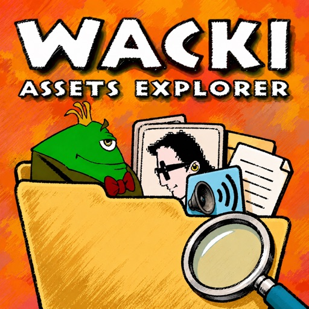

<p align="center">
  
</p>

# Wacki Assets Explorer

A standalone desktop tool for browsing the original **Wacki** game data — the
`*.DTA` archives and every asset type inside them — with live preview, palette
testing, and batch export. Built on [Nuklear](https://github.com/Immediate-Mode-UI/Nuklear)
(immediate-mode GUI) + SDL2.

It is a *thin layer over the engine*: it compiles a small SDL-free subset of the
real engine sources in-place (`../src/{depack,archive,assets,graphics,font,…}`),
so every preview reflects exactly how the game decodes that asset — no
re-implementation. It does **not** run the scene/VM/game loop; the few engine
symbols those would provide are stubbed in [`src/stubs.c`](src/stubs.c).

## Build & run

```sh
cd assets-explorer
make            # fetch deps (first time) + build -> dist/wacki-viewer
make deps       # just fetch/verify third-party libs (see below)
make run        # build + launch against ./data (symlinked to ../data)
make app        # macOS: bundle as a double-clickable .app (no console — see below)
make clean      # remove dist/ (keeps fetched deps)
```

Or from the repo root: `make viewer` (delegates here). Needs SDL2
(`sdl2-config`) and, for the first build, `curl` (to fetch deps — see
[Dependencies](#dependencies)). The window/GUI build is the default; the CLI
modes below run headless.

Assets are read from `./data/` (a symlink to the engine's `../data`), so run the
binary from this directory — or pass an explicit path.

### macOS app bundle

`dist/wacki-viewer` is a bare Unix executable, so launching it from Finder opens
a Terminal/console window. `make app` wraps it in a proper
`dist/Wacki Assets Explorer.app` — double-click it (or `open` it) and the GUI
launches with **no console**, a Dock icon, and the logo. Launched this way its
working directory is `/`, so it can't see `./data` and instead pops the
"locate a .DTA file" dialog on first run — point it at your game's `data/` folder.

(The bundle links Homebrew's SDL2 by absolute path, so it runs on this machine
as-is. CI bundles the dylib into the released `.app` so downloads run on any Mac.)

### Cross-platform builds & CI

The same `make` builds the viewer on **Linux**, **Windows**, and **macOS** — the
Makefile resolves the per-platform link bits (`PLATFORM_LIBS`) and SDL2 comes
from `sdl2-config` everywhere:

- **Linux** — `sudo apt-get install libsdl2-dev` (or your distro's package),
  then `make`. Dynamic SDL2.
- **Windows** — MSYS2/MINGW64 (`pacman -S mingw-w64-x86_64-SDL2`), then `make`.
  Produces `dist/wacki-viewer.exe` linked as a **GUI subsystem** binary, so it
  runs with no console window (the Windows analogue of the macOS `.app`).
- **macOS** — `brew install sdl2`, then `make` / `make app`.

CI ([`.github/workflows/assets-explorer.yml`](../.github/workflows/assets-explorer.yml))
builds and smoke-tests all three on every push/PR and uploads the archives as
artifacts. The Windows zip bundles the mingw DLLs (SDL2, libwinpthread) so it
runs standalone; the macOS zip ships the dylib-bundled `.app`.

Releases are **decoupled from the engine**: the viewer has its own tag namespace,
so it doesn't ride along on the engine's frequent `v*` tags. Cut a viewer release
by pushing an `assets-explorer-v*` tag — it gets its own GitHub Release (marked
non-latest so it doesn't displace the engine's):

```sh
git tag assets-explorer-v1.0.0 && git push origin assets-explorer-v1.0.0
```

## What it previews

| Type        | Preview                                                            |
|-------------|-------------------------------------------------------------------|
| ANIM (.WYC) | decoded frames, palette selector, auto-play, sprite-sheet, GIF     |
| PIC         | full RGBA image on a transparency checkerboard                    |
| PAL         | 16×16 swatch grid; "Palette test" renders the current sprite in every palette |
| MASK / FILD | 1bpp/8bpp region bitmap (FILD = a room's walkability map)         |
| WAV         | waveform + playback (play/stop), raw `.wav` export                |
| FLIC/AVI    | cutscene player (DANE_30/40/50) with synced audio                |
| SCR         | section-coloured plain-text view (Wacky/Gadki/Item scripts)      |

Every asset also has: type badge, sortable/filterable list, metadata cards, an
on-demand hex popup, native "Save As" export (PNG / sprite-sheet / GIF / raw),
and a `--dump-all <dir>` batch mode.

## CLI

```sh
./dist/wacki-viewer                      # GUI (default DANE_02.DTA)
./dist/wacki-viewer <FILE.DTA|.AVI>      # GUI on a specific file
./dist/wacki-viewer --list               # list entries + type tally
./dist/wacki-viewer --dump NAME OUT.png  # render one asset to PNG
./dist/wacki-viewer --gif  NAME OUT.gif  # render an ANIM to animated GIF
./dist/wacki-viewer --dump-all DIR       # batch-export a whole archive
./dist/wacki-viewer --screenshot OUT.png # render the GUI to PNG (headless)
```

## Dependencies

The third-party single-header libraries are **not committed**. `make deps`
(run automatically before the first build) fetches pinned, checksum-verified
copies into `third_party/` — which is gitignored. It's idempotent and fully
offline once the files are present (a sha256 match means no network request);
a checksum mismatch aborts the build rather than compiling unexpected code.

| Library         | Pinned ref                              | Files                                  |
|-----------------|-----------------------------------------|----------------------------------------|
| nuklear         | tag `v4.13.3`                           | `nuklear.h` + `nuklear_sdl_renderer.h` |
| stb             | commit `013ac3b` (write v1.16)          | `stb_image_write.h`                    |
| msf_gif         | commit `a17d110` (post-v2.4, C99-clean) | `msf_gif.h`                            |
| tinyfiledialogs | commit `cc6b593` (v2.9.3 mirror)        | `tinyfiledialogs.c` + `.h`             |

The pins + sha256 sums live in [`tools/fetch-deps.sh`](tools/fetch-deps.sh). To
bump a library: change its ref and sha256 there, then `make deps`. (Note: the
nuklear SDL_Renderer backend's `<SDL.h>` include is forced via
`#define NK_SDL_RENDERER_SDL_H <SDL.h>` in `main.c`, so newer nuklear releases
that default to `<SDL2/SDL.h>` still build against our sdl2-config include path.)

## Layout

```
assets-explorer/
  Makefile          self-contained build (reaches ../src for engine sources)
  tools/
    fetch-deps.sh   download + sha256-verify the third-party libs (make deps)
    Info.plist      macOS .app bundle metadata (make app)
    make-icns.sh    build the .app's AppIcon.icns (make app)
    app-icon.png    512px icon source (committed fallback for CI / fresh clones)
  src/              UI + asset-preview code
    main.c          window, layout, all UI panels & CLI modes
    catalog.{c,h}   mount DTA, list/classify entries
    render.{c,h}    asset -> RGBA (ANIM/PIC/PAL/MASK/FILD, sprite-sheet)
    vaudio.{c,h}    WAV playback + waveform
    vflic.{c,h}     AVI demux + cutscene frames/audio
    hexdump.{c,h}   raw byte view/export
    stubs.c         engine symbols the viewer doesn't link
  third_party/      fetched single-header libs (gitignored; see make deps)
  data -> ../data   symlink to the game assets (gitignored)
  dist/             build output (gitignored)
```

## Updating the app icon

The macOS `.app` Dock/Finder icon is built from `tools/app-icon.png` (a 512px
PNG) by `tools/make-icns.sh` during `make app`. To change it, replace that file
— or the gitignored high-res `icon-source.png`, which `make-icns.sh` prefers —
and rebuild the bundle:

```sh
make app
```

(The bare binary no longer sets an SDL window icon, so the Linux/Windows window
& taskbar icon is the system default; the branded icon ships in the macOS `.app`.)

