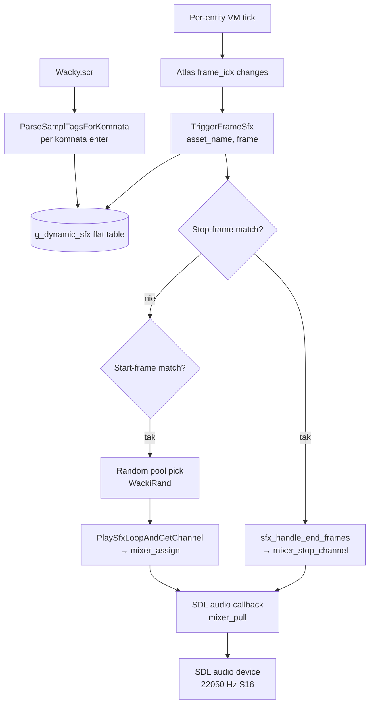
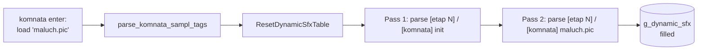
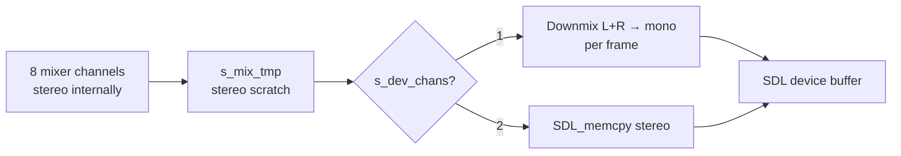

# Audio pipeline

Trzy źródła audio konkurują o pojedyncze `SDL_AudioDevice`:

1. **Mixer** (`src/audio.c`) — 8 channels, mówi do device co ~46 ms callback'iem
2. **Cutscene AVI** (`src/flic.c`) — własny SDL_AudioDevice na czas
   odtwarzania (otwiera + zamyka po zakończeniu, żeby nie kolidować z mixerem)
3. **`[sampl]` triggery** (`src/audio/sfx.c`) — wykorzystują mixer'a do
   gry SFX'ów zsynchronizowanych z klatkami animacji

Ten dokument skupia się głównie na (3) — najmniej oczywistym kawałku
z trzech mocno powiązanych mechanizmów.

## Wysokopoziomowy przepływ



## Format `[sampl]` w `Wacky.scr`

Plik tekstowy z hierarchią `[etap]N / [komnata]X / [animacja]ATLAS.wyc /
[sampl] ...`. Każdy `[sampl]` wiąże listę WAV'ów z listą tupli
(klatek), które aktywują/dezaktywują wav-y.

Trzy kształty tupli:

| Kształt | Znaczenie | Reprezentacja w `g_dynamic_sfx` |
|---|---|---|
| `(N,)` | Play trigger przy klatce N (no loop) | `frame_start=N, frame_end=NONE` |
| `(N,M)` | Play przy N + loop do M | `frame_start=N, frame_end=M` |
| `(,M)` | Stop-only — przy klatce M zatrzymaj cokolwiek z tego [sampl] | `frame_start=-1, frame_end=M, wav=NULL` |

### Przykład „muffled rock" (Ebek idle)

```scr
[etap] 1
  [komnata] init
    [animacja] ebek.wyc
      [sampl] Muzik05.wav Muzik06.wav Muzik07.wav Muzik08.wav Muzik09.wav
              (95,) (,1) (,25) (,48) (,49) (,61)
```

Co tu się dzieje:

- Frame 95 Ebeka = klatka idle gdzie zakłada słuchawki → start trigger
- Random pool z 5 WAV'ów → pick jeden
- 5 stop-only triggers na klatkach 1, 25, 48, 49, 61 — gdy Ebek
  cyklicznie wraca do dowolnej z nich, muzyka się zatrzymuje
- Każdy `(95,)` per-WAV jest oddzielnym wpisem w `g_dynamic_sfx`
  (5 entries), random pool zbiera je przez `collect_random_sfx_pool`
- `(,M)` entries są stop sentinelami: `frame_start=-1`, `wav=NULL` —
  trigger time ignoruje konkretny wav i woła
  `mixer_stop_channel` dla **wszystkich** SfxState należących do tego assetu

### Sekcje `[komnata] init` vs `[komnata] <name>`



`init` to per-stage default — sample'e które aplikują się do każdej
komnaty w etapie (np. idle-music Ebeka). `<name>` to room-specific —
ptak za oknem, dźwięk kiosku, kroki w korytarzu.

Oryginał miał jeden wspólny lookup; nasz port flatuje obie sekcje do
`g_dynamic_sfx`. Pass `init` idzie pierwszy → room-specific entries
mogą nadpisać identyczne `(asset, frame_start)` triple gdyby trzeba
było (żaden shipped script tego nie robi).

## Per-frame trigger

`TriggerFrameSfx(atlas_name, frame)` wołane raz na klatkę gry, dla
każdego entity którego atlas zaawansował klatkę:

```c
void TriggerFrameSfx(const char *asset_name, int frame) {
    sfx_handle_end_frames(asset_name, frame);          // stop pass

    int n = collect_random_sfx_pool(asset_name, frame, ...);
    if (n == 0) return;                                // no start trigger
    int idx = WackiRand((uint16_t)n);

    int has_sibling_stop = ... ;                       // any (,M) for this asset?
    int want_loop = (pool_end[idx] != NONE) || has_sibling_stop;
    PlaySfxLoopAndGetChannel(pool[idx], want_loop);
}
```

Kluczowe szczegóły:

- **Stop pass idzie pierwszy** — żeby kończąca się klatka `(N,M)` mogła
  zatrzymać wav przed potencjalnym restartem na innym `(M,?)` trigger'ze
- **`frame == frame_end` exact match** — nie `>=`. Stop firuje przy
  dokładnym match'u klatki. Inaczej `(,1)` zatrzymałby przy każdej
  klatce ≥ 1, co przy `(95,)` start oznacza natychmiastowe stopowanie
  w tym samym ticku
- **Random pool** — wszystkie wpisy z tym samym `(asset, frame_start)`
  są pulą; trigger pickuje jeden przez `WackiRand`
- **`has_sibling_stop`** — gdy jest jakikolwiek stop-only `(,M)` w tym
  samym `[sampl]` group, włącz looping. Bez tego wav z `(95,)` zagrałby
  raz i ucichł — stop sentinel nigdy by się nie aktywował

## Stop-only handling

```c
if (e->frame_start < 0 || e->wav == NULL) {
    // Stop-only entry from (,M) tuple
    for (j = 0; j < g_sfx_state_count; ++j) {
        if (g_sfx_state[j].asset == asset_name) {
            mixer_stop_channel(g_sfx_state[j].channel);
            g_sfx_state[j].channel = -1;
            g_sfx_state[j].playing_flag = 0;
        }
    }
}
```

Mirror oryginalnej semantyki: przy `(,M)` match'u silnik nie wie który
WAV z grupy aktualnie gra — sweepa wszystkie SfxState należące do
assetu.

## Stop przy destroy entity

```c
// src/script_bridge/entity.c::ScriptCallDestroyEnt
AnimAsset *atlas = ent_ptr_resolve(EOFF(e, ATLAS_SLOT));
if (atlas && atlas->name[0]) {
    StopAllSfxForAsset(atlas->name);
}
```

Bez tego: scenariusze typu "boy on skateboard hits banana → destroy
entity" pozostawiałyby pętlę SFX deska-jazdy grającą w nieskończoność
— `sfx_handle_end_frames` firuje tylko gdy entity ticka. Po destroy'u
nic nie ticka.

## Mixer (`src/audio.c`)

Pojedynczy `SDL_AudioDevice`, 22050 Hz, S16, **stereo wewnętrznie**:

| Channel | Cel | Caller |
|---|---|---|
| 0 | Music (looped) | `PlayMenuMusic`, `TickMenuMusic` |
| 1 | Dialog speech | `PlayDialogLine`, `IsDialogLinePlaying` |
| 2..7 | SFX pool | `PlaySfx`, `PlaySfxPanned`, `PlaySfxLoopAndGetChannel` |

### Backend compat (mmiyoo / handheld)

Miyoo Mini Plus SDL2 backend wspiera tylko mono S16 z fixed
buffer 1024. Mixer wewnętrznie pracuje stereo (dla pozycyjnego pan),
a w końcówce callback'a downmixuje L+R → mono jeśli `s_dev_chans == 1`:

```c
SDL_OpenAudioDevice(NULL, 0, &want, &s_mix_spec,
    SDL_AUDIO_ALLOW_CHANNELS_CHANGE | SDL_AUDIO_ALLOW_SAMPLES_CHANGE);
s_dev_chans = s_mix_spec.channels;  // 1 na Miyoo, 2 na desktopie
```



### Pozycyjne SFX (T36)

`PlaySfxPanned(wav, gain_l, gain_r)` ustawia `s_mix[ch].gain_l`/`gain_r`
per kanał (0..255, 128 = unity). Wektor pan obliczany przez
`SoundQueueMixForListener(listener_x, listener_y)` w `src/audio/sound_queue.c` —
zwraca packed `(R<<16)|(C<<8)|L`, `ScriptCallSoundPlay` rozkłada to
na `eL = L + C/2`, `eR = R + C/2`.

## WAV loading

```c
int mixer_load_wav(const char *name, Uint8 **buf, Uint32 *len) {
    // Try DTA archive FIRST — every shipped WAV lives there
    if (try_load_wav_from_dta(name, ...))  return 1;
    // Filesystem fallback — dev override (drop a WAV next to binary)
    if (try_load_wav_at(NULL, name, ...))  return 1;
    if (try_load_wav_at(g_data_root, ...)) return 1;
    if (try_load_wav_at("./data", ...))    return 1;
    return 0;
}
```

Kolejność istotna na slow storage (SD card na Miyoo): bez DTA-first
każdy SFX play robił 4-6 nieudanych `fopen` zanim trafił do archiwum
= ~30 ms straconych syscalli per call + flood of "Couldn't open"
printf'ów od SDL_RWops.

## Test coverage

`tests/test_sampl_parser.c` (10 cases) pokrywa:

- Trzy kształty tupli (`(N,)`, `(N,M)`, `(,M)`)
- Random pool (multiple WAV-ów per start frame)
- Pełny pattern z `wacky.scr` — `Muzik05..09 (95,) (,1) (,25) (,48) (,49) (,61)`
- Edge cases: orphan `[sampl]`, kolejne `[animacja]` bloki, `[komnata]` boundary

`audio/sfx.c` jest linkowane do test binary z no-op stub'ami dla
mixer'a — parser i state machine są w pełni testowalne bez SDL audio.

## Referencje w kodzie

- **Parser**: `src/audio/sfx.c::ParseSamplTagsForKomnata`
- **Trigger**: `src/audio/sfx.c::TriggerFrameSfx` + `sfx_handle_end_frames`
- **Per-komnata wiring**: `src/scene/komnata.c::parse_komnata_sampl_tags`
- **Mixer callback**: `src/audio.c::mixer_pull`
- **Pozycyjny pan**: `src/audio/sound_queue.c::SoundQueueMixForListener`
- **Tests**: `tests/test_sampl_parser.c` (10 cases pokrywające trzy
  kształty tupli + edge cases)
