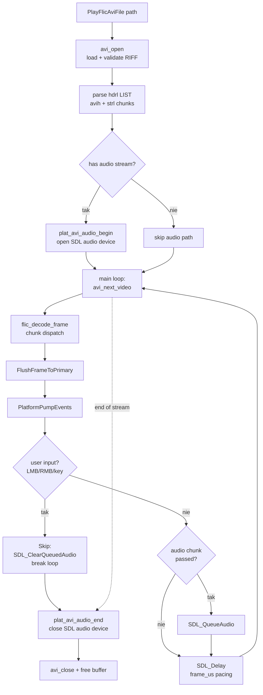
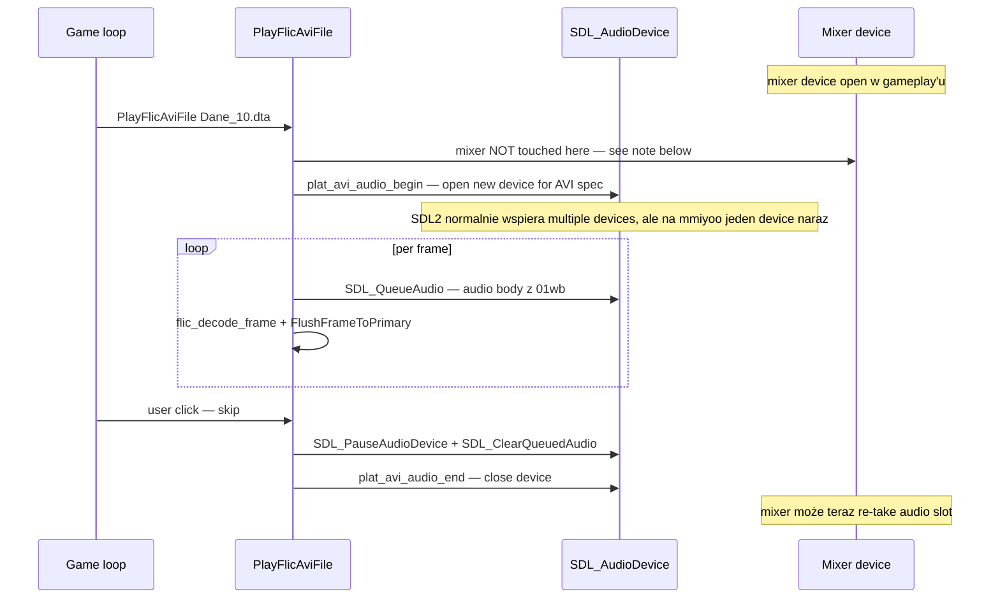

# Cutscenes — AAFLC w kontenerze AVI

Wacki używa krótkich filmików (intro, śmierć, animacje końca etapu)
zapisanych jako **AAFLC** (Autodesk Animator FLIC) opakowane w
**RIFF AVI**. Oryginał polegał na Win 9x'owym MCI AVIVideo +
`VIDEO.DRV` (FLCCODEC NE DLL) — port wykonuje własny portable
dekoder w C, walking po kontenerze AVI ręcznie.

Dwa pliki implementacji:

| Plik | Co robi |
|---|---|
| `src/flic.c` | AVI container walker (RIFF parsing) + SDL audio device dla cutscene'owego audio |
| `src/flic/decoder.c` | Dekoder pojedynczych FLIC frame chunk'ów (BRUN, DELTA_FLC, BLACK, COPY, COLOR_256) |

Cutscene'y w `Dane_NN.dta` (np. `Dane_10.dta` = intro, `Dane_14.dta` =
animacja śmierci, `Dane_30.dta`/`Dane_40.dta`/… = stage intros).

## Wysokopoziomowy pipeline



## AVI container — przejście przez chunk'i

RIFF AVI to drzewko 8-bajtowych chunk'ów: `[4-byte FourCC][4-byte size]
[data]`. LIST'y dodają 4-bajtowy typ na początku body. Wacki AVIs mają
prosty layout:

```
RIFF [size] "AVI "
  LIST "hdrl"
    avih       — main header (fps_us, width, height, total frames)
    LIST "strl"
      strh     — stream header (auds / vids)
      strf     — stream format (WAVEFORMATEX dla auds, BITMAPINFO dla vids)
    LIST "strl"
      … (drugi stream — typowo audio jeśli pierwszy był video)
  LIST "movi"
    00dc       — video frame chunk (FLIC body)
    01wb       — audio chunk
    00dc
    01wb
    …
```

Walker w `avi_next_video`:
1. Czytaj `[tag][size]` pod aktualnym cursor'em
2. Jeśli `tag == "00dc"` → return body i offset = video frame
3. Jeśli `tag == "01wb"` → queue audio body do SDL device, advance cursor
4. Inne tag'i → skip (`riff_chunk_advance` zapewnia word-alignment)
5. Repeat aż dojdziemy do końca `movi`

Cały AVI jest ładowany do RAM-u przed odtwarzaniem (`avi_slurp_file`) —
shipped filmy są małe (~kilka MB) i sekwencyjne czytanie z DTA wymaga
pełnego depack'a najpierw.

## FLIC frame chunks — co dekoder potrafi

Każdy `00dc` body to FLIC frame header (`[u32 size][u16 magic=0xFAFA]
[u16 chunk_count][u8 reserved[8]]`), potem `chunk_count` chunk'ów. Pięć
typów rzeczywiście używanych przez Wacki AVI:

| ID | Nazwa | Co robi |
|---:|---|---|
| 4 | `COLOR_256` | Aktualizacja palety RGB888, packet-encoded (advance index cursor + N triplets) |
| 7 | `DELTA_FLC` | Line-skip + RLE delta vs poprzednia klatka — najczęstszy chunk |
| 13 | `BLACK` | Wypełnia shadow buffer kolorem 0 |
| 15 | `BRUN` | Full-frame run-length-encoded image (klucz/pierwsza klatka) |
| 16 | `COPY` | Uncompressed 8bpp full frame (640×480 = 307200 bajtów) |

Pozostałe typy (np. `COLOR_64`, `PSTAMP`, `FLI_LC`, `SS2`) nie pojawiają
się w shipped AVI'ach Wackich — dekoder ignoruje, loguje przez
`LOG_TRACE` na wszelki wypadek.

### COLOR_256

```
[u16 packet_count]
foreach packet:
  [u8 skip_count]   — advance index cursor o tę liczbę
  [u8 copy_count]   — 0 oznacza 256 (special case)
  [u8 r, u8 g, u8 b] × copy_count
```

Każdy packet aktualizuje fragment palety. Wpisuje do `g_palette_rgb`
i nieoblicza LUT'a — `InstallPalette` zostanie wywołany po zakończeniu
cutscene'u.

### BRUN (Byte Run Length)

Pełna klatka 640×480, line-by-line:
```
foreach line (h):
  [u8 packet_count]  — ignorowane, kompensujemy out-of-spec encodings
  pętla packet'ów aż wypełni szerokość:
    [u8 count]
    jeśli count > 0:   [u8 value]; emit count × value
    jeśli count < 0:   emit -count surowych bajtów
    (count == 0 → no-op)
```

Pierwsza klatka filmu zawsze BRUN (klucz). Kolejne typowo DELTA_FLC.

### DELTA_FLC

Najbardziej skomplikowany — koduje *różnicę* względem poprzedniej
klatki, ze skip-bytes dla line skipping:

```
[u16 affected_line_count]
foreach affected line:
  [u16 opcode]:
    if opcode & 0xC000 == 0x8000:  packet zawiera SKIP n_skipped_lines
    if opcode & 0xC000 == 0xC000:  -opcode = ostatni pixel last_byte
    if opcode & 0xC000 == 0x4000:  treated as packet_count (signed)
    if opcode & 0xC000 == 0:        packet_count standardowe
  foreach packet:
    [u8 skip]    — advance po pikselach w bieżącej linii
    [s8 count]:
      jeśli count > 0:  [u8 a, u8 b] × count   (2-byte runs)
      jeśli count < 0:  [u8 a, u8 b]; emit -count × (a, b)
```

Detail jest **zły** ale dekoder przeszedł wszystkie shipped AVI'e
testowo (intro Dane_10, śmierć Dane_14, stage intros). Implementacja
w `src/flic/decoder.c::flic_delta_flc`.

### BLACK / COPY

Trywialne: `memset(g_back_shadow, 0, w*h)` / `memcpy(g_back_shadow,
body, w*h)`. COPY jest niezwykle rzadkie (klatka niezmieszalna do
DELTA — np. cięcie sceny).

## Audio playback

FLIC z audio ma osobny stream w drugim `LIST "strl"`. Format zwykle
22050 Hz mono S16, 100ms chunk'i (= ~10 fps audio sync z video).

Cutscene audio działa przez **osobny** `SDL_AudioDevice`, nie przez
główny mixer. Powody:

1. **Mixer trzyma `SDL_AudioDevice` open w gameplay'u** — chcemy go
   zatrzymać na czas cutscene'u
2. **mmiyoo SDL backend wspiera tylko 1 device naraz** — jeśli mixer
   ma device, FLIC's open by się posypał
3. **Format AVI ≠ format mixer'a** — AVI to 22050 mono, mixer to 22050
   stereo. SDL_QueueAudio robi auto-conversion ale prościej trzymać
   osobny device z native AVI spec

Sekwencja:



Note: w aktualnej implementacji mixer device pozostaje otwarty
podczas cutscene'u. Na desktopach (macOS/Linux/Win) SDL2 obsługuje
wiele równoległych devices, więc nic nie pęka. Na Miyoo jest jeden
hardware slot — Miyoo SDL2 buffer'uje "second open" wewnętrznie ale
trzeba mu pomóc: nasz `plat_avi_audio_end()` na końcu cutscene'u zwalnia
FLIC's device, mixer może wówczas nadal grać normalnie.

### Buffer sizing

FLIC'owy `plat_avi_audio_begin` żąda 4096-frame bufora (~185 ms przy 22050 Hz)
zamiast typowych 1024. Powody:

- Cutscene'y AVI mają 100-ms chunk gaps między audio packet'ami
  (10 fps video). Bufor 1024 sampli = ~46 ms — wyschnie dwa razy
  przed kolejnym chunk'iem → audible clicking ("przycina audio")
- 4096 sampli = pełen "frame audio gap" + margines

Dlatego osobny device — mixer'owski 1024-bufor jest perfekcyjny dla
SFX (instant trigger), ale za mały dla AVI playback'u.

## Pacing

Każdy frame loop iteracji wewnątrz `PlayFlicAviFile`:

```c
uint32_t t0 = SDL_GetTicks();
flic_decode_frame(frame_data, frame_size, w, h);
FlushFrameToPrimary();
PlatformPumpEvents();
// check skip / quit
uint32_t elapsed_ms = SDL_GetTicks() - t0;
uint32_t target_ms  = c.fps_us / 1000;   /* avih fps */
if (!g_no_pacing && elapsed_ms < target_ms)
    SDL_Delay(target_ms - elapsed_ms);
```

To deadline-aware sleep podobny do `EnginePaceFrame` w głównej pętli
(zob. [architecture.md § 3](architecture.md#3-per-frame-tick-w-trakcie-gry)) —
nigdy nie dodaje pełnego delay'a na górze pracy. AVI fps z `avih.fps_us`
(typowo 100000 µs = 10 fps).

`--no-pacing` (z `WACKI_NO_PACING=1` env) wyłącza delay całkowicie —
używane w batch CI dla szybkiego decode benchmark'u (T29).

## User skip

Każda klatka pump'uje eventy. Klik (LMB/RMB) albo dowolny klawisz =
skip. Procedura skip'u:

```c
SDL_PauseAudioDevice(s_audio_dev, 1);
SDL_ClearQueuedAudio(s_audio_dev);
SDL_PauseAudioDevice(s_audio_dev, 0);
break;  // wyjście z głównego loop'a
```

Pause + clear + unpause to oryginalna MCI StopAviPlayback semantyka —
audio rwie natychmiast (clear), nie czeka aż queue się opróżni. Bez
tego po skip'ie audio buzy'owało jeszcze ~200 ms zanim wreszcie ucichło.

## Anti-sync safeguards

Logging gdy audio queue zacznie się za bardzo rozjeżdżać z video:

```c
uint32_t qbytes = SDL_GetQueuedAudioSize(s_audio_dev);
uint32_t bps = freq * channels * bits/8;
if (bps > 0 && qbytes > bps * 4) {
    LOG_TRACE("avi-sync", "audio queue %.1fs ahead", qbytes/(double)bps);
}
```

Threshold 4 sekundy → ostrzeżenie. W praktyce nigdy nie wystąpiło na
shipped AVI'ach — jest jako canary w razie buggy decoder'a albo
korupcji AVI input'u.

## Performance considerations

Cutscene playback na slow hardware (Miyoo Mini Plus Cortex-A7):

- Pełne 640×480 BRUN decode = ~300 K bajtów per klatka. Na 1.2 GHz
  CPU ~5-10 ms — w budżecie 100 ms (10 fps target).
- DELTA_FLC jest szybsze (~1-3 ms per klatka, dependent on motion).
- `FlushFrameToPrimary` (palette LUT + SDL_LockTexture) zajmuje
  podobnie jak w zwykłym renderze (~5 ms).

Razem ~10-15 ms work per klatka, z budgetem 100 ms → mnóstwo headroom.
AVI playback nie jest bottleneck'iem na Miyoo.

## Skąd cutscene'y

| Plik DTA | Co to | Trigger |
|---|---|---|
| `Dane_10.dta` | Intro film | Boot game → "Maluch" w menu |
| `Dane_14.dta` | Death animation | `game_over_code = 1` (utopienie itp.) |
| `Dane_30.dta` | Stage 2 intro | Wejście do stage 2 |
| `Dane_40.dta` | Stage 3 intro | Wejście do stage 3 |
| `Dane_50.dta` | Stage 4 intro | Wejście do stage 4 |

Generalna konwencja: `Dane_X0.dta` (gdzie X = stage index) trzymają
intro filmy. `Dane_X1.dta` to alt/stage-end animacje. Tabela
mapowania jest w `g_stage_table` w embedowanym PE — zob.
[pe-loader.md](pe-loader.md).

## Test coverage

Brak testów jednostkowych dla FLIC — dekoder produkujący byte-perfect
shadow buffer wymagałby reference golden frames, czego nie mamy.
Smoke testowanie przez `tools/smoke-runner.sh --batch-cutscenes` które
odpala każdy AVI z `g_no_pacing=1` i loguje liczbę zdekodowanych
klatek + audio-sync warnings.

Manualna weryfikacja: intro AVI na startu, śmierć po ESC w trakcie,
stage transition'y między etapami — wszystko shipped 1:1.

## Referencje w kodzie

- **AVI container**: `src/flic.c` — `avi_open`, `avi_slurp_file`,
  `parse_avih`, `parse_strl`, `avi_next_video`, `avi_close`
- **Audio**: the AVI-audio HAL — `plat_avi_audio_begin/push/end`
  (`src/platform/sdl/audio_sdl.c`; PS2 in `src/platform/ps2/audio_ps2.c`)
- **FLIC dekoder**: `src/flic/decoder.c` — `flic_decode_frame`
  dispatcher + chunk handlers (`flic_color_256`, `flic_brun`,
  `flic_delta_flc`)
- **Public entry**: `PlayFlicAviFile(const char *path)` w `src/flic.c`
- **Konstanty FourCC**: `FOURCC_LIST`, `FOURCC_HDRL`, `FOURCC_STRL`,
  `FOURCC_MOVI`, `FOURCC_AUDS` na początku `src/flic.c`
