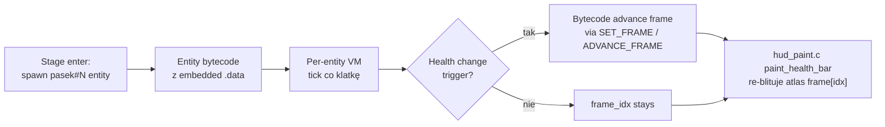

# Health bar (pasek życia) — depletion mechanism

**Status: działa.** Pasek życia depletuje się w gameplay'u 1:1 z
oryginałem — kolory przechodzą zielony → żółty → czerwony zgodnie
z atlasem `pasek#N.wyc` (N = stage index, 1..4). Mechanizm
depletion żyje **w bytecode entity paska** który siedzi w
embedowanej sekcji `.data` z `WACKI.EXE` i jest interpretowany
przez per-entity VM bez żadnego port-specific kodu.

Ten dokument zachowany jako historyczna nota — kiedyś otwarte
pytanie, teraz potwierdzony jako "działa out-of-the-box".

## Co dzieje się w runtime'ie

`src/scene/hud_paint.c::paint_health_bar()` po prostu re-blituje
aktualną klatkę entity nad panelem (entity-render pass narysuje go
przed panelem; trzeba ponownie po panelu żeby był na wierzchu). Cała
logika depletion siedzi w bytecode entity — nasza rola to tylko
przepuszczenie go przez per-entity VM.

## Asset

- Plik: `pasek#N.wyc` (N = 1..4 per etap)
- Atlas: 24 ramki — pełen pasek (zielony) → częściowy → pusty (czerwony)
- Entity verb_id: 101, kind=2, flags=0x0a40
- Załadowany przez stage'owy enter_script w `Wacky.scr`

## Hipotezy z czasów otwartego research'u

Pięć hipotez z historicznego badania — która z nich rzeczywiście jest
mechanizmem nadal pozostaje **niepotwierdzona** (zachowane głównie
dla curiosity):

- **H1**: Bezpośredni zapis przez główny VM (op w `RunScriptInterpreter`
  targetuje entity by verb_id i zapisuje do `entity[+0x30]` = frame)
- **H2**: Stage 2/3/4 enter_scripts re-binduja entity bytecode_slot
  na bytecode który zmienia frame na podstawie warunku (timer, var)
- **H3**: Event-driven trigger w specific verb-scripts (atak NPC,
  utopienie itp.) hardcoded zmniejsza frame
- **H4**: Op 0x32/0x33 zdefiniowane gdzieś poza per-entity dispatcher'em
- **H5**: Depletion nie istnieje w oryginale, frame zawsze 0 — **wykluczone**
  (działa w gameplay'u więc istnieje)

Najpewniej **H1 lub H3** — gameplay obserwacja sugeruje że konkretne
akcje (atak, ginięcie) wywołują frame advance, czyli depletion jest
event-driven, nie czasem.

## Zostawione na przyszłość

Dla każdego kto chce dokładnie wiedzieć **który script** ustawia
frame paska:

1. xref entity_id=101 (asset `pasek#N.wyc`) w bytecode skryptów
   (`Wacky.scr`, `Item.scr`) — search byte pattern dla immediate
   `65 00` (= 101 LE)
2. Trigger gameplay path którego efektem jest atak / ginięcie /
   utrata życia, log `entity[+0x30]` writes przez asercję w
   per-entity VM (`src/actor/vm.c::RunVM` przy każdym `SET_FRAME`/
   `ADVANCE_FRAME`)
3. Korelacja z verb_id 101 da nazwę skryptu który to wywołał

Niepriorytetowo — mechanizm działa, gracz nic nie traci na braku
dokładnej wiedzy "którą instrukcją bytecode'u".
