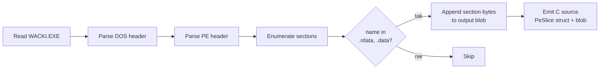
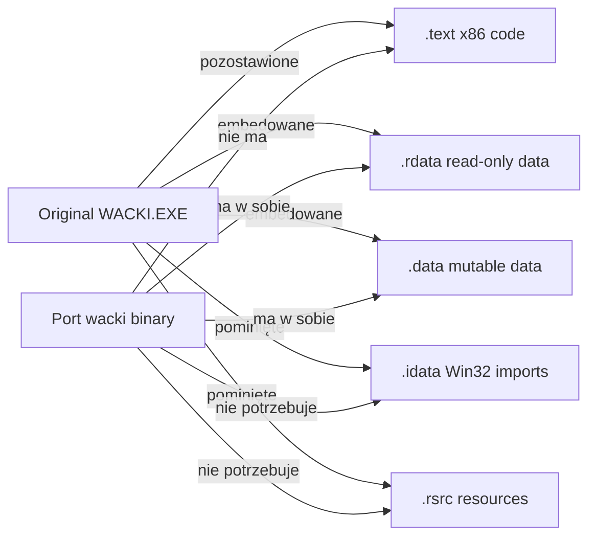

# PE loader — embedowanie `WACKI.EXE` jako passive image

Najbardziej nietypowy trick w porcie. Oryginalna binarka `WACKI.EXE`
nie tylko zawierała kod x86 — przechowywała też **tablice danych
runtime'u**: tabele skryptów, palety, nazwy assetów, listy komnat,
parametry stage'y. Cała ta wiedza siedziała w sekcjach `.rdata` i
`.data` PE32.

Port nie wykonuje x86 (nie ma sensu — chcemy cross-platform), ale
musi dosięgnąć tych tablic. Rozwiązanie: w czasie buildu wyciągamy
`.rdata` + `.data` z `WACKI.EXE` i embedujemy je jako `const` tablicę
w binarce engine'u. Runtime resolver mapuje oryginalne VA (`0x00400000+`)
na nasz blob — engine "wierzy" że jest stara binarka, tylko o jej
sekcji kodu zapomniano.

## Diagram

```mermaid
flowchart TB
    A[data/WACKI.EXE<br/>302 KB PE32] --> B[tools/embed-pe-data<br/>build-time]
    B --> C[Parse PE header<br/>find .rdata + .data sections]
    C --> D["src/embedded_wacki_pe.c<br/>const uint8_t blob + const PeSlice slices"]
    D --> E[Linked into wacki binary]

    F[Runtime engine] --> G[xlat_binary_ptr 0x00428220]
    G --> H[PeLoaderRead<br/>VA → blob offset]
    H --> I{Hit a known slice?}
    I -- tak --> J[Return blob + offset]
    I -- nie --> K[Canary log:<br/>"unmapped VA"]
```

## Layout `src/embedded_wacki_pe.c`

Wygenerowany — gitignored. Zawiera dwie tablice:

```c
const PeSlice g_wacki_pe_slices[] = {
    { .va = 0x00422000, .size = 0x12000, .blob_offset = 0x0    },  // .rdata
    { .va = 0x00434000, .size = 0x16000, .blob_offset = 0x12000 }, // .data
};
const size_t g_wacki_pe_slices_count = 2;

uint8_t g_wacki_pe_blob[] = { 0x4d, 0x49, 0x4e, 0x41, ... };  // ~158 KB
const size_t g_wacki_pe_blob_size  = 162304;
const uint32_t g_wacki_pe_image_base = 0x00400000;
```

Trzy sekcje pominięte:
- `.text` — kod x86 (nie wykonujemy)
- `.idata` — Import Address Table (Win32 API — nie istnieje na macOS/Linux/handheld)
- `.rsrc` — Win32 resources (ikona, version info — nie używane)

Co ważne: `g_wacki_pe_blob[]` **nie jest `const`** w przeciwieństwie do
`g_wacki_pe_slices[]`. Engine pisze do niej przez `SET_TAGGED_FIELD`
(op 0x18 w głównym VM, plus parę miejsc w stubs.c) — modyfikuje
tablice danych w runtime'ie tak jak robił to oryginał, gdy te
siedziały w `.data` sekcji writable.

## Build-time tool — `tools/embed-pe-data.c`



Output: `src/embedded_wacki_pe.c`. Pojedynczy plik z dwoma globalami
+ `const PeSlice[]`. Linked do `dist/wacki` jak każde inne źródło.

## Runtime resolver — `xlat_binary_ptr` / `PeLoaderRead`

```c
void *xlat_binary_ptr(uint32_t va) {
    for (size_t i = 0; i < g_wacki_pe_slices_count; ++i) {
        const PeSlice *s = &g_wacki_pe_slices[i];
        if (va >= s->va && va < s->va + s->size) {
            return g_wacki_pe_blob + s->blob_offset + (va - s->va);
        }
    }
    /* Canary log fires once if engine ever needs an unmapped VA.
     * On hit, audit the caller — it's reaching into .text/.idata/.rsrc
     * which we deliberately don't ship. */
    if (!s_canary_logged) {
        LOG_INFO("pe", "unmapped VA 0x%08X — read from skipped section?", va);
        s_canary_logged = 1;
    }
    return &s_zero_page;  // 4-KB zero-filled fallback so caller doesn't crash
}
```

Zerowa strona (`s_zero_page`) to safety net — jeśli kod zapyta o
adres spoza naszych slice'ów, nie crashuje, tylko czyta zera. Canary
log mówi developer'owi że coś przeoczyliśmy.

W praktyce canary nie odpala się dla shipped kodu — wszystko czego
engine używa siedzi w `.rdata`/`.data`. Test pokrycia jest w
`tests/test_pe_loader.c` + `tests/test_pe_loader_lifecycle.c` +
`tests/test_pe_loader_malformed.c`.

## Co siedzi w tych sekcjach

Typowe adresy `0x004xxxxx` które engine resolves:

| Range | Co | Skąd referencja |
|---|---|---|
| `0x00422xxx`-`0x00432xxx` | `.rdata` — stage tables, asset name strings, palette LUT, opcode arg tables | Globalne pointery hardkodowane w skryptach |
| `0x00434xxx`-`0x0044Axxx` | `.data` — runtime state (script_vars buffer, inventory tables) | Zapisywalne, mutowane przez VM |

Konkretne przykłady używane w naszym kodzie:

| Symbol | VA | Co trzyma |
|---|---|---|
| `g_stage_table` | `0x00428220` | 5 entry tablica stage'y (etap 1..5) z atlas names + intro AVI |
| `g_persp_profile` | `0x00449960` | Per-stage perspective params (band rows, scale factors) |
| Stage 1 enter script | `0x004271E8` | Bytecode wykonywany na enter pierwszej komnaty |
| Default palette | różne `.rdata` adresy | Per-stage `paleta.pal` strony |

## Dlaczego to ważne dla cross-platform



Bez tej sztuczki port musiałby albo:
- **Replikować** wszystkie tabele danych ręcznie jako stałe w C — setki KB
  ręcznie przepisanego stuff'u, fragile, łatwo o pomyłkę
- **Pamiętać** o `WACKI.EXE` jako runtime dependency — psuje cross-platform
  bo musimy go shipować z każdym artefaktem
- **Wykonywać** oryginalny x86 code via JIT/emulator — to porzucamy
  cross-platform na ARM, no thanks

Embed slice tablicowy to złoty środek: zero runtime deps, zero
emulacji, działa na ARM tak samo jak na x86_64, a engine wierzy że
ma "swoje" sekcje danych.

## Build-time dependency

`data/WACKI.EXE` musi istnieć w czasie buildu. Plik prywatny (copyright
oryginału) — nie commitowany. W CI ściągany z prywatnego URL'a z secret
`WACKI_EXE_URL`. Po embed'zie bytes są transformowane w slice table
wewnątrz binarki — sam plik nie ląduje w żadnym artefakcie release.

Makefile gen rule:

```
$(EMBEDDED_PE_SRC): $(EMBEDDED_PE_BIN) $(EMBED_PE_TOOL)
	$(EMBED_PE_TOOL) $(EMBEDDED_PE_BIN) $(EMBEDDED_PE_SRC)
```

`embed-pe-data` jest buildowany przez `HOSTCC` (nie cross-compiler) bo
musi się wykonać na build machine — odtwarza C source który potem
idzie do cross-compile path.

## Referencje w kodzie

- **Embed tool**: `tools/embed-pe-data.c`
- **Generated file**: `src/embedded_wacki_pe.c` (gitignored)
- **Runtime resolver**: `src/pe_loader.c::xlat_binary_ptr`, `PeLoaderRead`
- **Slice struct**: `include/wacki/embedded_exe.h`
- **Tests**: `tests/test_pe_loader.c`, `_lifecycle.c`, `_malformed.c`
